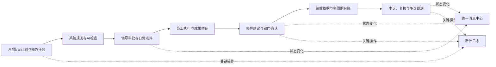

# 企业计划成果管理系统

> 面向员工、直属领导、部门负责人、系统管理员和争议评审人员，贯通计划编制、智能检查、审批点评、成果举证、绩效沉淀、消息协同与争议裁决的企业工作闭环平台。

系统以月计划、周计划、日计划和额外任务为执行主线，将“计划要做什么、过程由谁负责、成果如何证明、结果如何确认”沉淀为可追溯、可核验、可复盘的业务数据。

## 核心能力

- **计划全过程管理**：支持月、周、日计划及额外任务的草稿、编辑、提交、撤回、审批、驳回、调整和版本留痕，并校验上下级计划关系、日期、权重和状态边界。
- **AI计划与成果检查**：结合确定性规则与千问语义分析，识别计划内容笼统、交付物不可核验、任务重复冲突、日期范围异常和成果证据不足；所有AI结论保留引用原文和判断依据，不参与自动审批或自动改分。
- **多角色工作台**：员工、直属领导、部门负责人、系统管理员和争议评审人员使用各自工作空间，查看与自身职责和组织数据范围一致的任务、统计和操作入口。
- **成果与证据闭环**：成果按计划事项提交并保留版本，支持 PDF、Word、DOCX、ZIP 证据文件，领导提出确认建议，部门负责人完成最终确认或驳回。
- **绩效依据与业务台账**：按日、周、月、季度和年度汇总计划、成果、审批、申诉等记录，支持个人、下属和部门范围查询与导出。
- **统一消息中心**：审批、点评、补审、成果确认、计划调整、申诉、裁决、导出和系统风险统一生成个人消息；顶部和侧边栏同步显示未读数量，并支持业务对象直达。
- **可靠导出与资料包**：异步生成 PDF、Word 和 ZIP，支持成果证据聚合、SHA-256 完整性校验、失败重试、超时恢复和过期清理。
- **组织权限与审计治理**：提供员工注册与管理、部门/项目组、角色、权限、工作日规则、AI配置和审计日志；后端统一执行角色、组织范围、对象归属和流程状态校验。
- **申诉与争议裁决**：员工可在期限内发起申诉；授权评审小组可查看完整资料链、处理回避、提交个人意见并形成有审计记录的人工裁决结论。

## 业务闭环



## 角色工作台

| 角色 | 主要能力 |
| --- | --- |
| 员工 | 工作台、月/周/日计划、额外任务、成果提交与记录、绩效依据、申诉和计划调整 |
| 直属领导 | 组织范围工作台、月/周计划审批、日计划点评与风险标记、成果确认建议、额外任务审批、下属台账 |
| 部门负责人 | 部门周期总览、月计划审批、日计划风险补审、成果最终确认、通知待办、标准配置、参考分规则、部门台账和导出任务 |
| 系统管理员 | 管理工作台、员工注册与管理、组织、角色、权限、工作日规则、AI模型配置与指标、审计日志 |
| 争议评审人员 | 授权案件查询、裁决资料包、评审小组、回避处理、个人意见和人工裁决 |

## AI检查机制

AI能力聚焦于“提供可解释的检查依据”，而不是替代管理者决策：

1. 后端先执行必填、日期、权重、文件格式和文件真实性等确定性规则。
2. 系统组装当前计划、上下级计划、组织标准、验收项和证据原文，并为可引用内容建立来源编号。
3. 千问逐维度返回 `PASS / RISK / UNKNOWN`，后端反查来源并过滤无法被原文证明的结论。
4. 风险等级由后端规则统一校准；成果完成比例根据验收项证据覆盖结果计算建议区间，不由模型自由决定。
5. 模型未配置、超时或调用失败时保留系统规则结果，并明确显示“AI语义未执行”，不会伪装成检查通过。
6. 内容、规则、模型或提示词版本变化后，旧报告自动失效；相同有效报告可在提交时复用，避免重复等待和调用。

详细说明见 [AI检查接入说明](docs/AI检查接入说明.md)。

## 工程结构

```text
planning-platform/
├─ backend/          Spring Boot 后端、数据库初始化与业务服务
├─ web-admin/        Vue 3 PC Web，多角色统一工作台
├─ mobile-uniapp/    uni-app H5 / 微信小程序 / App 基础员工端
├─ docs/             架构、需求映射、开发记录与验收文档
└─ docker-compose.dev.yml
```

## 技术栈

| 层级 | 技术 |
| --- | --- |
| PC Web | Vue 3、TypeScript、Vite、Element Plus、Pinia、Vue Router、Axios |
| 移动端 | uni-app、Vue 3、Pinia、Wot UI |
| 后端 | Java 17、Spring Boot 3.3.7、Spring Security、MyBatis-Plus、JWT |
| 数据与会话 | MySQL 8、Redis 7 |
| 文档与证据 | PDFBox、Apache POI、ZIP、SHA-256 |
| AI | 阿里云千问兼容接口、可追溯来源校验、提示词版本管理、调用指标与限流 |

## 快速启动

### 1. 启动基础服务

前置条件：Docker Desktop，或本机已安装 MySQL 8 和 Redis 7。

```powershell
docker compose -f docker-compose.dev.yml up -d
```

### 2. 启动后端

前置条件：JDK 17、Maven。

```powershell
cd backend
mvn.cmd spring-boot:run
```

- 后端默认地址：`http://localhost:48090/api`
- 健康检查：`http://localhost:48090/api/health`

### 3. 启动 PC Web

前置条件：Node.js、npm。

```powershell
cd web-admin
npm.cmd install
npm.cmd run dev
```

访问地址：`http://localhost:5180`

### 4. 可选：启动移动端 H5

```powershell
cd mobile-uniapp
npm.cmd install
npm.cmd run dev:h5
```

完整环境变量、生产部署、文件目录和备份恢复说明见 [启动说明](docs/development/启动说明.md)。

## 开发账号

开发环境初始化超级管理员：

```text
admin / Admin@123456
```

`DEMO_DATA_ENABLED=true` 时创建演示账号：

```text
employee   / Demo@123456
leader     / Demo@123456
dept.owner / Demo@123456
```

生产环境必须关闭演示数据，并替换管理员密码、数据库密码、JWT密钥和AI配置加密密钥。

## 关键配置

| 环境变量 | 默认值 | 用途 |
| --- | --- | --- |
| `SERVER_PORT` | `48090` | 后端端口 |
| `DB_URL` / `DB_USERNAME` / `DB_PASSWORD` | 本机开发数据库 | MySQL连接 |
| `REDIS_HOST` / `REDIS_PORT` | `127.0.0.1:6379` | Redis连接 |
| `JWT_SECRET` | 仅开发默认值 | JWT签名密钥，生产环境必须替换 |
| `DEMO_DATA_ENABLED` | `true` | 是否创建演示账号和业务数据 |
| `UPLOAD_ROOT` / `EXPORT_ROOT` | 项目本地目录 | 成果附件和导出文件目录 |
| `AI_ENABLED` / `QWEN_API_KEY` / `QWEN_MODEL` | 默认关闭外部模型 | AI部署级后备配置；系统管理端启用配置优先 |

## 验证

```powershell
cd backend
mvn.cmd test

cd ../web-admin
npm.cmd run build
```

当前测试覆盖权限与组织数据范围、计划状态流转、并发终态保护、AI来源校验与报告复用、成果证据真实性、消息通知、申诉裁决、导出状态机、文件完整性和统一错误响应等关键路径。

## 文档导航

- [启动、部署与备份](docs/development/启动说明.md)
- [AI计划与成果检查](docs/AI检查接入说明.md)
- [需求、数据库、接口与页面映射](docs/development/需求-数据库-接口-页面映射表.md)
- [当前开发明细](docs/development/当前开发明细.md)
- [统一消息中心交付记录](docs/development/2026-07-20-统一消息中心交付记录.md)
- [裁决端规格](docs/four-layer-specs/2026-07-16-dispute-adjudication.md)
- [自研底座技术方案与迁移计划](docs/architecture/自研底座技术方案与迁移计划.md)

## 设计边界

- AI只提供计划完善和人工审批参考，不自动审批、自动驳回、自动确认成果或自动修改参考分。
- 数据权限以后端校验为准，前端菜单和按钮隐藏不构成安全边界。
- MySQL是计划、成果、台账和审计数据的权威来源；Redis不保存唯一业务事实。
- 员工账号由管理员直接注册，系统生成账号并要求首次登录修改默认密码，不发送邀请消息。
- 生产环境不自动初始化演示数据，业务附件和数据库必须处于同一备份周期。
